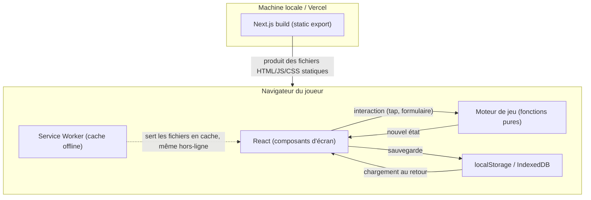
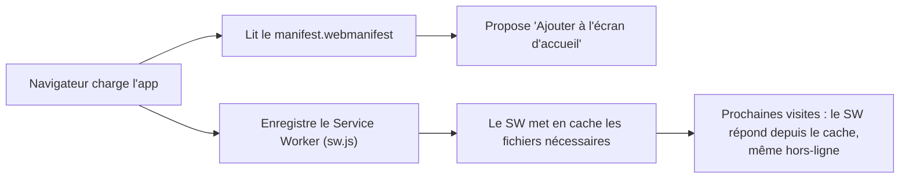
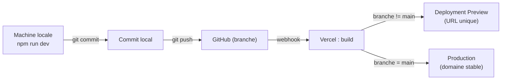

# Comment AntaVerse fonctionne — guide pédagogique

> **But de ce document** : te permettre, à toi qui as créé AntaVerse, de comprendre
> — et d'expliquer à quelqu'un d'autre — comment l'application est réellement
> construite aujourd'hui : les technologies utilisées, pourquoi elles sont là,
> comment le repository est organisé, comment une interaction de joueur devient
> un écran mis à jour, comment le code part de ta machine jusqu'en production.
>
> Ce document décrit le code **tel qu'il existe réellement**, pas une
> architecture idéale. Quand une partie est legacy, partiellement migrée ou
> volontairement asymétrique (c'est le cas de Quoi de 9 face aux autres jeux),
> c'est expliqué comme tel.
>
> **Relation avec [`ARCHITECTURE.md`](ARCHITECTURE.md)** : `ARCHITECTURE.md`
> est la référence technique concise — les règles de dossiers, ce qui est
> partagé, ce qui ne l'est pas, et pourquoi. Ce document-ci est plus long et
> plus didactique : il explique les mêmes réalités mais en partant de zéro sur
> chaque concept, et en suivant des exemples concrets de bout en bout. Les deux
> se complètent ; celui-ci renvoie vers `ARCHITECTURE.md` plutôt que de
> dupliquer ses règles.

---

## Sommaire

1. [Vue d'ensemble](#1-vue-densemble)
2. [Stack technique](#2-stack-technique)
3. [Organisation du repository](#3-organisation-du-repository)
4. [Comment Next.js fait fonctionner AntaVerse](#4-comment-nextjs-fait-fonctionner-antaverse)
5. [Architecture d'un jeu](#5-architecture-dun-jeu)
6. [State et mécaniques de jeu](#6-state-et-mécaniques-de-jeu)
7. [Persistance](#7-persistance)
8. [UI et design system](#8-ui-et-design-system)
9. [Assets et branding](#9-assets-et-branding)
10. [Fonctionnement de la PWA](#10-fonctionnement-de-la-pwa)
11. [Du code local à la production](#11-du-code-local-à-la-production)
12. [Build et scripts](#12-build-et-scripts)
13. [Tests](#13-tests)
14. [Shared vs game-specific](#14-shared-vs-game-specific)
15. [Exemple complet d'une interaction](#15-exemple-complet-dune-interaction)
16. [Lexique](#16-lexique)
17. [« Comment j'ai construit AntaVerse »](#17-comment-jai-construit-antaverse)
18. [Légal, support et publication sur les stores](#18-légal-support-et-publication-sur-les-stores)

---

## 1. Vue d'ensemble

### Qu'est-ce qu'AntaVerse

AntaVerse est une **collection de jeux de soirée** ("party games"), regroupés
dans une seule application mobile-first, installable comme une app (PWA), et
sans backend : tout tourne dans le navigateur du téléphone, rien n'est envoyé
à un serveur pendant une partie.

Aujourd'hui, huit jeux sont enregistrés dans l'app (voir
[`src/lib/games.ts`](src/lib/games.ts)) :

- **Quoi de 9 ?** — jeu de questions/thèmes par équipes, avec système de
  jokers, bombe, et scoring.
- **La Relance**, **Sans le dire** — jeux à deux équipes.
- **Purple**, **Triman**, **Roulette du Chaos**, **Palmier** — jeux à liste de
  joueurs (pas d'équipes fixes).
- **Fuck** — jeu de cartes à maître du jeu, avec rotation du rôle après trois
  victoires consécutives.

### Architecture générale, en une image



Il n'y a pas de serveur applicatif en production : Next.js est utilisé comme
**générateur de site statique** (voir §4), et tout ce que fait l'app côté
"backend" (sauvegarde de partie, calcul de score, tirage aléatoire) se passe
dans le navigateur, en JavaScript, avec le stockage local du téléphone.

### Schéma mental simple

Retiens ces trois couches, elles reviendront tout au long du document :

1. **La coquille (`src/app/`)** — définit les URLs et affiche le bon écran.
   Ne connaît aucune règle de jeu.
2. **Un jeu (`src/games/<jeu>/`)** — un module autonome : ses écrans, ses
   règles, son state, sa persistance, son style.
3. **Le socle partagé (`src/components/`, `src/lib/`,
   `src/games/shared/`)** — tout ce qui est identique entre plusieurs jeux
   (ou entre l'app et les jeux), extrait une fois que c'est prouvé dupliqué.

---

## 2. Stack technique

Pour chaque techno : ce que c'est en général, pourquoi elle est là, comment
AntaVerse l'utilise concrètement.

### Node.js

**En général** : Node.js est l'environnement qui exécute du JavaScript en
dehors d'un navigateur — sur ta machine ou sur le serveur de build de Vercel.
C'est ce qui fait tourner `npm`, les scripts de build, et le serveur de
développement.

**Dans AntaVerse** : `package.json` fixe `"engines": { "node": "22.x" }` —
c'est la version que Vercel utilise pour builder, et celle que tu dois avoir
en local pour que `npm run dev`/`npm run build` se comportent pareil.

### npm

**En général** : npm est le gestionnaire de paquets de Node — il installe les
dépendances (`node_modules/`) listées dans `package.json`, et exécute les
scripts qu'on y définit (`npm run dev`, `npm run build`, etc.).

**Dans AntaVerse** : `package.json` (§12) définit une vingtaine de scripts —
pas seulement `dev`/`build`, mais toute la chaîne de validation de contenu et
de préparation PWA. C'est le point d'entrée unique pour savoir "que peut-on
faire dans ce repo".

### Next.js (16.2.10, App Router)

**En général** : Next.js est un framework construit sur React qui ajoute le
routage (une URL = un fichier), le rendu serveur, et — ce qui compte ici — la
capacité de **tout pré-générer en fichiers statiques** au lieu de faire
tourner un serveur Node en production.

**Dans AntaVerse** : `next.config.ts` fixe `output: "export"`. Ça veut dire
qu'à chaque build, Next.js visite toutes les routes et écrit un fichier HTML
(+ JS/CSS) par route dans `out/` — comme un site figé. Il n'y a **pas** de
serveur Next.js qui tourne en production ; Vercel sert juste `out/` comme des
fichiers statiques (voir `vercel.json`, §11). C'est ce qui rend l'app
installable en PWA sans backend : chaque écran est un fichier livrable
d'avance.

### React (19.2.7)

**En général** : React est une bibliothèque qui construit une interface à
partir de **composants** — des fonctions qui décrivent "à quoi ressemble cet
écran étant donné cet état" — et qui se charge de mettre à jour le DOM
(la page réellement affichée) quand cet état change, sans que tu aies à
manipuler le HTML toi-même.

**Dans AntaVerse** : React sert à construire tous les écrans de jeu — la
carte "ajouter un joueur", l'écran de partie qui affiche la carte piochée
dans Palmier, le tableau des scores dans Quoi de 9. Un **composant** est un
fichier `.tsx` qui exporte une fonction retournant du JSX (le mélange
HTML-dans-JavaScript que tu vois dans `features/game/game-client.tsx` par
exemple).

*Composant client vs composant serveur* : dans l'App Router, un composant est
"serveur" par défaut (il ne s'exécute qu'au moment du build/export) sauf s'il
porte `"use client"` en première ligne, auquel cas il s'exécute aussi dans le
navigateur et peut réagir aux clics, au state, etc. Comme AntaVerse est en
export statique et que presque tout est interactif, la grande majorité des
composants de jeu sont `"use client"` — voir §4.

### TypeScript (6.0.3)

**En général** : TypeScript est du JavaScript avec un système de **types** —
tu déclares la forme des données (`GameState`, `Player`, `Team`...) et l'outil
vérifie, avant même d'exécuter le code, que tu ne mélanges pas les formes
(par exemple, que tu n'oublies pas un champ obligatoire).

**Dans AntaVerse** : `tsconfig.json` active `"strict": true` **et**
`"noUncheckedIndexedAccess": true` (accéder à `tableau[i]` renvoie
`T | undefined`, pas juste `T` — ça force à gérer le cas "index absent"
explicitement, utile vu que beaucoup de logique de jeu manipule des tableaux
de joueurs/cartes). Chaque jeu déclare ses types dans
`lib/game/types.ts` (ex. `src/games/palmier/lib/game/types.ts`), et c'est ce
contrat de types qui rend les fonctions du moteur de jeu (§6) fiables : le
compilateur refuse un appel à `drawCard()` avec un objet qui n'a pas la bonne
forme.

### Tailwind CSS 4 — et le CSS "à la main"

**En général** : Tailwind CSS est un framework qui te donne des classes
utilitaires (`flex`, `p-4`, `text-lime`) au lieu de fichiers `.css`
traditionnels — tu composes le style directement dans le JSX.

**Dans AntaVerse, la réalité est mixte, et c'est volontaire** :

- **Quoi de 9** utilise Tailwind (`@tailwindcss/postcss` compilé via
  `postcss.config.mjs`) — on le voit dans ses composants,
  ex. `className="safe-shell grid min-h-[100dvh] place-items-center"` dans
  `src/games/quoi-de-9/features/game/game-client.tsx`.
- **Les sept autres jeux** écrivent leur CSS à la main, dans un fichier
  `styles.css` par jeu (ex. `src/games/palmier/styles.css`), qui définit des
  variables CSS (§8) et des classes classiques.
- `src/app/globals.css`, le point d'entrée CSS global, commence par
  `@import "tailwindcss";` puis un bloc `:root` de tokens de design partagés
  (couleurs, espacements). Tailwind ne génère que les classes qu'il trouve
  réellement référencées dans le code scanné — donc son coût est quasi nul
  pour les jeux qui ne l'utilisent pas.

`ARCHITECTURE.md` documente ce choix explicitement : Quoi de 9 "a le droit"
d'être différent architecturalement, plutôt que de forcer tous les jeux dans
un seul système visuel (§14).

### Vitest (4.1.10)

**En général** : Vitest est un outil de **tests unitaires** — tu écris une
fonction `test()`/`it()` qui appelle ton code avec des entrées connues et
vérifie la sortie, sans navigateur, très rapide.

**Dans AntaVerse** : `vitest.config.ts` fixe l'environnement `jsdom` (un DOM
simulé, pour les rares tests qui rendent un composant), l'alias `@` →
`./src` (le même alias que TypeScript), et scanne
`src/**/*.test.{ts,tsx}` + `scripts/**/*.test.mjs`. La grande majorité des
tests sont des tests du **moteur de jeu pur** — par exemple
`src/games/palmier/lib/game/engine.test.ts` vérifie que `drawCard()` fait
exactement ce qui est attendu selon la carte tirée, sans jamais toucher au
DOM. Voir §13.

### Playwright (1.61.1)

**En général** : Playwright est un outil de **tests bout-en-bout (E2E)** — il
pilote un vrai navigateur (ou une émulation mobile), clique, tape du texte,
et vérifie ce qui s'affiche réellement à l'écran, comme le ferait un joueur.

**Dans AntaVerse** : `playwright.config.ts` ne définit que deux profils
mobiles — `mobile-chrome` (Pixel 7) et `mobile-safari` (iPhone 15), pas de
profil desktop, cohérent avec le positionnement mobile-first de l'app. Les
tests tournent contre `out/` servi statiquement (`npm run preview`, voir
§12), pas contre `npm run dev` — donc un test E2E valide vraiment ce qui sera
livré en production, y compris le Service Worker. Un fichier par jeu dans
`e2e/` (ex. `e2e/quoi-de-9.spec.ts`) simule une vraie partie de bout en bout.

### IndexedDB

**En général** : IndexedDB est une base de données **dans le navigateur**,
plus capable que localStorage (elle stocke des objets structurés, gère des
versions de schéma, n'est pas limitée à des chaînes de texte).

**Dans AntaVerse** : utilisée par **un seul jeu**, Quoi de 9, via le paquet
`idb` (un wrapper qui rend l'API IndexedDB — nativement basée sur des
callbacks/événements — utilisable avec `async`/`await`). Les autres jeux
n'en ont pas besoin : leur state est plus simple et tient très bien dans
localStorage. Voir §7.

### localStorage

**En général** : localStorage est un stockage clé→texte simple, persistant
tant que l'utilisateur ne vide pas les données du site, limité à environ
5 Mo, et **synchrone** (donc simple à utiliser, mais bloquant si abusé).

**Dans AntaVerse** : c'est le mécanisme de persistance de sept des huit jeux
(tous sauf Quoi de 9), via le helper partagé `readJson`/`writeJson`/
`removeJson` de [`src/lib/local-storage-json.ts`](src/lib/local-storage-json.ts).
Chaque jeu écrit sous **sa propre clé namespacée** (ex.
`"palmier:current-game"`), jamais une clé partagée — voir §7.

### PWA / Service Worker

Voir §10, section dédiée — c'est un sujet assez dense pour mériter sa propre
explication complète.

### Git

**En général** : Git est le système de contrôle de version — il garde
l'historique de chaque changement de fichier, permet de travailler sur des
branches séparées, et de revenir en arrière.

**Dans AntaVerse** : usage standard — commits, branches, `main` comme branche
de production. Voir §11.

### GitHub

**En général** : GitHub héberge le repository Git dans le cloud et sert de
point d'intégration (revue de code, historique partagé, déclencheur de CI/CD).

**Dans AntaVerse** : le repository distant. Pousser sur GitHub est ce qui
déclenche un build Vercel (§11).

### Vercel

**En général** : Vercel est une plateforme d'hébergement/déploiement,
particulièrement liée à Next.js, qui peut soit faire tourner du code serveur,
soit — comme ici — simplement servir des fichiers statiques.

**Dans AntaVerse** : `vercel.json` déclare `"framework": null` — Vercel ne
traite **pas** l'app comme un déploiement Next.js "managé" (pas de fonctions
serverless, pas de rendu à la demande). Il exécute juste
`buildCommand: "npm run build"` puis sert `outputDirectory: "out"` comme un
serveur de fichiers statiques, avec des règles de cache HTTP dédiées pour
`sw.js` et les assets `_next/static/`. Voir §10 et §11.

### Autres dépendances notables

- **`zod` (4.4.3)** — validation de schémas. Utilisé côté contenu (le pipeline
  de questions de Quoi de 9, §12) pour valider la forme des données de jeu et
  générer un JSON Schema exporté.
- **`sharp`** — traitement d'image côté build, utilisé uniquement par
  `scripts/generate-pwa-icons.mjs` pour générer les icônes PWA à partir du
  logo (§9).
- Les formulaires de setup reposent principalement sur du `useState` React
  classique, avec la gestion partagée des listes de joueurs dans
  `src/games/shared/lib/use-player-fields.ts` (§8). `react-hook-form` n'est
  pas une dépendance du projet actuel.

---

## 3. Organisation du repository

```
src/
  app/            → coquille de routage (pages Next.js)
  components/     → UI au niveau "app entière" (accueil, PWA)
  lib/            → utilitaires partagés, sans connaissance d'un jeu précis
  games/
    shared/       → infrastructure utilisée par 2+ jeux
    <slug>/       → un dossier par jeu, autonome
content/          → source de vérité du contenu de Quoi de 9 (questions, thèmes)
public/           → fichiers statiques servis tels quels (brand, manifest, sw.js)
scripts/          → outillage de build et de contenu (Node, hors app)
e2e/              → tests Playwright
```

**Pourquoi cette séparation existe** : elle fait correspondre la structure de
fichiers à une règle de dépendance stricte (documentée dans
`ARCHITECTURE.md`) — le code générique (`src/lib`) ne doit jamais connaître
les règles d'un jeu, le code partagé entre jeux (`src/games/shared`) ne doit
contenir que ce qui est *prouvé* dupliqué à l'identique par au moins deux
jeux, et chaque jeu (`src/games/<slug>`) reste libre d'avoir ses propres
choix (modèle de données, persistance, style) sans avoir à s'accorder avec
les autres. C'est ce qui permet à Quoi de 9 d'être structurellement différent
(Tailwind + IndexedDB) sans que ça "pollue" les sept autres jeux.

- **`src/app/`** — uniquement du routage : `page.tsx`, `layout.tsx`,
  `error.tsx` par route. Aucune règle de jeu n'y vit.
- **`src/components/`** — composants qui n'ont de sens qu'au niveau accueil
  de l'app : `game-card.tsx` (la tuile de jeu sur l'accueil),
  `service-worker-registration.tsx`, la synchronisation de thème globale.
- **`src/lib/`** — quatre fichiers seulement, génériques : `games.ts`
  (le registre), `random.ts` (`shuffle`), `local-storage-json.ts`,
  `use-theme-mode.ts`. Rien ici ne connaît la forme des données d'un jeu.
- **`src/games/shared/`** — détaillé en §8 et §14.
- **`content/`** — les questions/thèmes de Quoi de 9, écrits à la main sous
  forme de modules `.mjs` (`content/packs/*.mjs`) et de JSON par thème
  (`content/themes/<slug>/{theme.json, questions.easy.json, ...}`). C'est la
  **source**, jamais éditée directement dans le module du jeu — voir §12.
- **`scripts/`** — de l'outillage Node exécuté à la build ou à la demande, pas
  du code applicatif : pipeline de contenu, préparation PWA, génération
  d'icônes. Voir §12.
- **`e2e/`** — un fichier de test Playwright par jeu, plus un pour l'accueil.

---

## 4. Comment Next.js fait fonctionner AntaVerse

### Routes et pages

Chaque dossier sous `src/app/` correspond à un segment d'URL. Un fichier
`page.tsx` dans ce dossier est ce qui s'affiche à cette URL. Exemple concret,
le jeu Palmier :

```
src/app/palmier/page.tsx           → /palmier            (accueil du jeu)
src/app/palmier/joueurs/page.tsx   → /palmier/joueurs     (setup des joueurs)
src/app/palmier/partie/page.tsx    → /palmier/partie      (écran de jeu)
src/app/palmier/regles/page.tsx    → /palmier/regles      (règles)
src/app/palmier/layout.tsx         → layout appliqué à toutes ces routes
src/app/palmier/error.tsx          → écran d'erreur pour ce sous-arbre
```

Chacun de ces fichiers `page.tsx` est volontairement fin (souvent 5 à
25 lignes) : il importe et rend le vrai écran depuis
`src/games/palmier/features/*`. Par exemple,
`src/app/palmier/partie/page.tsx` se contente de rendre
`<GameClient />` venu de `src/games/palmier/features/game/game-client.tsx`.
C'est la règle documentée dans `ARCHITECTURE.md` : **`src/app` ne doit
jamais contenir de logique de jeu**, seulement le branchement URL → écran.

### Layouts

**En général** : un `layout.tsx` enveloppe toutes les pages de son
sous-arbre — utile pour du HTML/CSS/scripts communs sans les répéter par
page.

**Dans AntaVerse** : le layout racine
([`src/app/layout.tsx`](src/app/layout.tsx)) est un composant **serveur**
(pas de `"use client"`) qui pose `<html lang="fr" data-theme="dark"
suppressHydronWarning>`, déclare les métadonnées PWA (`manifest`, icônes,
`appleWebApp`), et injecte trois petits scripts en ligne :

1. un script (dev uniquement) qui désenregistre le Service Worker pour ne
   jamais servir de version en cache pendant que tu développes ;
2. un script qui force le thème sombre **avant** que React ne s'hydrate et
   supprime l'ancienne clé de préférence, afin que chaque ouverture reparte
   en sombre sans flash de mauvais thème ;
3. `CACHE_RECOVERY_SCRIPT` (prod uniquement) — si les feuilles de style ne se
   chargent pas (signe d'un déploiement périmé en cache), il vide les caches
   et désenregistre le Service Worker. Voir §10.

Il rend ensuite `{children}` (la page active), puis deux composants client :
`<RouteThemeSync />` et `<ServiceWorkerRegistration />`.

### Composants client vs serveur

**Composant serveur** (par défaut) : exécuté uniquement pendant l'export
statique, jamais réexécuté dans le navigateur. `src/app/page.tsx` (l'accueil)
en est un — il boucle sur `games` (le registre) et rend des `<GameCard />`,
mais lui-même n'a pas besoin d'interactivité.

**Composant client** (`"use client"` en tête de fichier) : hydraté dans le
navigateur, peut utiliser `useState`, gérer des clics, etc.
`src/components/game-card.tsx` en est un, parce qu'il lit le thème courant
(`useThemeMode`) pour choisir entre l'icône claire et l'icône sombre — une
donnée qui n'existe que côté client. Presque tous les écrans de jeu
(`features/game/game-client.tsx` de chaque jeu) sont des composants client,
puisqu'ils réagissent à des taps et gèrent un state qui évolue en direct.

### Navigation

La navigation entre écrans se fait via `<Link>` de Next.js (préchargement,
pas de rechargement de page complet côté client) ou `router.push(...)`
(ex. `SetupForm` de Palmier redirige vers `/palmier/partie` après création
de la partie). Point important documenté dans `ARCHITECTURE.md` : la
navigation client-side **ne décharge pas** la feuille de style de la route
précédente — les deux restent présentes dans `<head>` en même temps. C'est la
raison technique derrière toute une règle CSS détaillée en §8.

### Export statique (`output: "export"`)

À `npm run build`, Next.js génère, pour chaque route, un fichier HTML complet
dans `out/` (ex. `out/palmier/partie/index.html`), plus les bundles
JavaScript/CSS associés. `next.config.ts` complète ce mode avec
`trailingSlash: true` (chaque URL se termine par `/`, cohérent avec les noms
de dossiers `index.html`) et `images: { unoptimized: true }` (l'optimisation
d'image à la volée de Next.js nécessite un serveur, donc désactivée ici).
`typedRoutes: true` fait que TypeScript connaît statiquement l'ensemble des
routes valides — c'est pour ça que `route: Route` dans
`src/lib/games.ts` est typé et pas juste une chaîne libre.

---

## 5. Architecture d'un jeu

On suit deux jeux représentatifs, choisis parce qu'ils illustrent les deux
familles qui coexistent dans l'app.

### Palmier — le cas "normal"

`src/games/palmier/` :

```
data/          card-rules.ts, deck.ts        → contenu statique (le jeu de 52 cartes)
lib/game/      types.ts, engine.ts, engine.test.ts, persistence.ts, players.ts
components/    brand.tsx, card-reveal.tsx, palm-tree.tsx, playing-card.tsx,
               page-shell.tsx, resume-game-card.tsx
features/setup/  setup-form.tsx
features/game/   game-client.tsx
styles.css
```

- **`lib/game/types.ts`** définit `GameState` : `schemaVersion`, `players`,
  `activePlayerIndex`, `phase` (`"idle" | "reveal" | "collapse" | "end"`),
  `remainingDeck`, `currentCard`, `kingsDrawn`, etc.
- **`lib/game/engine.ts`** (~110 lignes) contient les **fonctions pures** qui
  transforment cet état — détaillé en §6.
- **`lib/game/persistence.ts`** sauvegarde/charge la partie en cours dans
  localStorage — détaillé en §7.
- **`features/setup/setup-form.tsx`** est l'écran d'ajout de joueurs ; il
  utilise le hook partagé `usePlayerFields` (§8) puis appelle
  `createGame()` + `saveCurrentGame()` et redirige vers `/palmier/partie`.
- **`features/game/game-client.tsx`** est l'écran de jeu : il charge la
  partie, gère l'animation de tirage, et appelle les fonctions du moteur.
- **`styles.css`** définit les variables d'accent du jeu et les scope avec
  `:root:has(.brand-mark--plm) { ... }` — le motif documenté en §8.
- **Tests** : `lib/game/engine.test.ts` (~193 lignes) — uniquement le moteur,
  aucun test de composant pour ce jeu.

La Relance, Sans le dire, Purple, Triman, Roulette du Chaos suivent la même
forme générale (types/engine/persistence + features/setup + features/game +
styles.css), avec des variations attendues : les jeux à deux équipes
(La Relance, Sans le dire) réutilisent `two-team-setup.ts` du dossier
partagé ; les jeux à liste ouverte de joueurs (Purple, Triman, Roulette du
Chaos, Palmier) construisent leurs joueurs localement (`createPlayers` dans
l'engine de chaque jeu) et utilisent `participant-list.ts` /
`use-player-fields.ts` du dossier partagé.

### Quoi de 9 — le cas volontairement différent

`src/games/quoi-de-9/` a la même forme de dossiers en surface, mais chaque
brique est plus riche :

- **Modèle de données** (`lib/game/types.ts`) : des `Team` (pas des
  `Player` isolés) avec `score`, un `status` qui est une **machine à états à
  15 valeurs** (`instructions → pass_phone → joker_opportunity → ... →
  turn_results → scoreboard → completed`), un système de jokers
  (`teamJokers`, `jokerUsages`), une mécanique de "bombe"
  (`bombTriggered`, `bombPenalty`), et des champs de minuteur
  (`timerStartedAt`/`timerEndsAt`).
- **`lib/game/scoring.ts`** isole le calcul de score
  (`calculateTurnScore(réponsesCorrectes, difficulté, bombe)`), séparé du
  reste de l'engine.
- **`lib/game/engine.ts`** fait ~681 lignes (contre ~110 pour Palmier) et
  utilise des gardes `assertStatus()` qui **lèvent une erreur** si on tente
  une transition invalide (`"Transition impossible depuis l'état ${status}"`)
  — plus strict que le style "retourne l'état inchangé" des autres jeux.
- **Persistance** : IndexedDB via `idb` (voir §7), avec une vraie migration
  de schéma entre versions.
- **`generated/content-bundle.json`** — pas du code écrit à la main : généré
  par `scripts/build-content-bundle.mjs` à partir de `content/` (§12). C'est
  ce que `data/questions.ts` importe directement.
- **Style** : Tailwind + `styles.css` propre au jeu, **sans** import de
  `game-base.css` — délibérément hors du système visuel partagé décrit en
  §8, comme documenté dans `ARCHITECTURE.md`.

**Ce qui est commun** aux deux malgré tout : la forme générale des dossiers
(`components/`, `features/setup`, `features/game`, `lib/game/`), le principe
"le moteur est fait de fonctions pures testées séparément de l'UI", et
l'usage de composants partagés qui *restent* génériques même pour Quoi de 9
(`use-theme-mode`, `random.ts`).

---

## 6. State et mécaniques de jeu

### Vocabulaire

- **State** ("état") : les données qui décrivent la partie à un instant T —
  `GameState` dans chaque jeu.
- **Fonction pure** : une fonction qui, pour les mêmes entrées, retourne
  toujours la même sortie, et ne modifie rien en dehors d'elle-même (pas
  d'accès au DOM, pas d'écriture disque). Le moteur de chaque jeu est écrit
  ainsi — ça le rend testable sans navigateur (§13) et prévisible.
- **Hook** : une fonction React (`use...`) qui donne à un composant l'accès à
  une capacité de React — du state (`useState`), un effet de bord
  (`useEffect`), une source externe synchronisée (`useSyncExternalStore`,
  utilisé par `use-theme-mode.ts`).
- **Prop** : une donnée passée d'un composant parent à un composant enfant,
  comme un paramètre de fonction.

### Le cycle, en général

```
interaction utilisateur (tap)
   → handler React (fonction dans le composant client)
   → appel à une fonction pure du moteur (engine.ts)
   → nouvel objet GameState (l'ancien n'est jamais modifié en place)
   → setState / commit()
   → React recalcule le JSX à partir du nouvel état
   → l'écran affiché change
   → (souvent) sauvegarde du nouvel état en persistance
```

### Version réelle : Palmier, "Secoue le palmier"

Dans `features/game/game-client.tsx`, `shakeAndDraw()` :

1. vérifie qu'aucune action n'est déjà en cours (`busy` ref, anti-double-tap) ;
2. déclenche l'animation de secousse (`revealing = true`) ;
3. attend `SHAKE_REVEAL_MS` (550 ms), le temps que l'animation joue ;
4. appelle `drawCard(game)` — la fonction pure de `engine.ts` :

```ts
export function drawCard(game: GameState, now = Date.now()): GameState {
  if (game.phase !== "idle" || game.remainingDeck.length === 0) return game;
  const [card, ...rest] = game.remainingDeck;
  // ... calcule kingsDrawn, maitrePouce, maitreQuestions selon la carte
  const phase = kingsDrawn === 4 ? "collapse" : "reveal";
  return touch({ ...game, remainingDeck: rest, currentCard: drawn, phase, /* ... */ }, now);
}
```

   Remarque le style : une garde en début de fonction (si la phase n'est pas
   `"idle"`, on retourne l'état tel quel — pas d'exception), puis un
   **spread** (`{ ...game, ... }`) qui construit un nouvel objet plutôt que
   de modifier `game` en place (c'est ce qu'on appelle l'**immutabilité** :
   l'ancien état reste valide et inchangé, ce qui simplifie énormément le
   raisonnement et les tests).
5. le composant appelle `commit(nouvelÉtat)`, qui met à jour le state React
   **et** appelle `saveCurrentGame()` (§7) ;
6. React re-render : la carte révélée s'affiche, l'accent visuel du palmier
   change selon `palmStageForKings(kingsDrawn)` — une fonction dérivée pure
   qui calcule un état visuel (`"stable" | "shaky" | "unstable" |
   "critical"`) à partir du nombre de rois tirés, **sans que cet état visuel
   soit lui-même stocké** ;
7. si la phase devient `"collapse"` (4ᵉ roi), une animation supplémentaire se
   joue, puis `onContinue()` appelle `completeCollapse()` pour repartir en
   `"idle"`.

### Quoi de 9 : le même principe, une machine à états plus riche

Le même schéma s'applique, mais chaque transition doit être **valide** dans
la machine à états (`instructions → pass_phone → ... → completed`) — sinon
`assertStatus()` lève une erreur immédiatement, plutôt que de laisser l'UI
dans un état incohérent. C'est le compromis "plus strict, plus verbeux" que
justifie la richesse du jeu (jokers, minuteur, bombe, plusieurs équipes).

---

## 7. Persistance

### Ce qui est du state React temporaire

Tant qu'un composant est monté, son `useState` vit en mémoire — un
`revealing = true` pendant une animation, un champ de formulaire en cours de
frappe. Rien de tout ça ne survit à un rafraîchissement de page si ce n'est
pas explicitement sauvegardé.

### Ce qui survit à un refresh : la persistance locale durable

Deux mécanismes coexistent, selon le jeu.

**localStorage — sept jeux sur huit.** Le helper partagé
[`src/lib/local-storage-json.ts`](src/lib/local-storage-json.ts) expose
`readJson`/`writeJson`/`removeJson` : lire-parser-valider (ou effacer si
invalide), écrire, supprimer — autour d'une seule clé JSON. Chaque jeu
écrit sous **sa propre clé namespacée** (ex. `"palmier:current-game"`,
`"qui-des-9:current-game"` — même le jeu qui n'utilise pas ce helper garde la
convention de nommage), et fournit sa propre fonction `isGameState()` : un
*type guard* qui revalide la forme exacte des données lues (version de
schéma, énumérations valides, formes de tableaux) avant de faire confiance à
`JSON.parse`. Si la donnée stockée est corrompue ou d'une version de schéma
inconnue, elle est simplement rejetée plutôt que de faire planter l'app.

**IndexedDB — Quoi de 9 seulement**, via le paquet `idb`. Base
`"qui-des-9"`, version `1`, un seul object store `"games"`, clé fixe
`"current"`. La fonction de sauvegarde/chargement
(`src/games/quoi-de-9/lib/game/persistence.ts`) a une **chaîne de repli** :
IndexedDB en premier choix, puis localStorage
(`"qui-des-9:current-game"`), puis même `window.name` en dernier recours —
utile dans des contextes de navigation privée où IndexedDB/localStorage
peuvent être bloqués. `migrateStoredGame()` gère la migration entre versions
de schéma (1 à 5), reconstruisant les anciens tours de jeu vers la forme
actuelle. Toutes les données passent aussi par `normalizeUnicodeDeep()` (pour
éviter les problèmes d'encodage de texte, cf. le test dédié
`quoi-de-9/lib/text/encoding.test.ts`).

### Namespaces par jeu

Chaque jeu a sa propre clé de stockage. Rien n'est jamais partagé entre
jeux — reprendre une partie de La Relance n'a aucune influence sur
Palmier, et vice-versa. C'est une conséquence directe de la règle
d'autonomie de chaque module de jeu (§3, §14).

### Reprise de partie

Chaque module de jeu expose une fonction de chargement
(`loadCurrentGame()`) appelée dans un `useEffect` de l'écran de jeu : s'il y
a une partie en cours valide, on l'affiche ; sinon, redirection vers l'écran
de setup. Le composant partagé `resume-game-card.tsx` (§8, §14) est ce qui
affiche, sur l'écran d'accueil d'un jeu, la carte "reprendre ta partie en
cours" quand une sauvegarde existe.

### Le thème (dark/light), à part

Le thème visuel est une préférence de session, gérée par
`use-theme-mode.ts` (§2, §8) : l'application démarre toujours en sombre et un
clic explicite peut passer en clair jusqu'à la prochaine ouverture. Il n'est
pas stocké et ne vit donc dans aucun des schémas ci-dessus.

---

## 8. UI et design system

C'est la partie de l'app la plus récemment consolidée. L'idée centrale :
**un seul système visuel partagé, paramétré par jeu**, plutôt que huit
implémentations séparées d'un même écran de setup ou d'une même carte
joueur.

### Le piège du `:root` global — et pourquoi il est évité

Rappel du mécanisme (§4) : la navigation client-side de Next.js ne décharge
**pas** la feuille de style de la route précédente. Si deux jeux définissaient
chacun `:root { --game-accent: ... }` dans leur propre `styles.css`, les
deux règles seraient en même temps dans `<head>` après une navigation
`/` → `/palmier` → `/triman`, et celle chargée **en dernier** gagnerait pour
**tout le document** — recolorant potentiellement un jeu avec l'accent d'un
autre, silencieusement.

La solution, appliquée dans chaque jeu (vérifié dans `palmier/styles.css`) :

```css
:root:has(.brand-mark--plm) {
  --game-accent: var(--plm-accent);
  --game-accent-dark: var(--plm-accent-dark);
  --game-accent-light: var(--plm-accent-light);
  --game-accent-glow: var(--plm-accent-glow);
}
```

`:has(.brand-mark--plm)` conditionne la redéfinition à la présence réelle,
dans le DOM, du marquage propre à ce jeu (son logo/brand-mark) — donc à la
route effectivement affichée, pas à l'ordre de chargement des feuilles de
style. C'est une isolation **par route active**, pas par fichier CSS. Cette
règle est non-négociable et documentée deux fois : dans `ARCHITECTURE.md` et
dans `CLAUDE.md` lui-même, parce que c'est le genre de bug silencieux et
difficile à repérer visuellement en dev.

### CSS variable (rappel)

Une variable CSS (`--nom: valeur;`) est une valeur nommée réutilisable dans
une feuille de style, redéfinissable selon le contexte (ici : selon le
thème, ou selon le jeu actif). C'est ce qui permet à un même composant
partagé (un bouton, une carte participant) de changer d'apparence sans
dupliquer son CSS.

### Palettes de jeu et palette équipes

- Chaque jeu déclare ses propres couleurs d'accent (`--plm-accent`,
  `--rdc-jackpot`, etc.) dans son `styles.css`, puis les expose au système
  partagé via le motif `--game-accent*` scopé ci-dessus.
- `src/games/shared/lib/team-palette.ts` définit `TEAM_PALETTE`, une liste
  ordonnée de couleurs — la position d'une équipe dans la liste des équipes
  détermine toujours la même couleur, partout dans l'app (Quoi de 9, La
  Relance, Sans le dire).
- `src/games/shared/lib/launcher-accents.ts` centralise l'accent principal
  de chaque jeu en tant que constante, importée par `src/lib/games.ts` pour
  colorer la tuile de la page d'accueil — pour éviter de hardcoder la
  couleur une deuxième fois en dehors du `styles.css` du jeu.

**Changer une palette à un seul endroit** : modifier `--plm-accent` (et ses
variantes) dans `palmier/styles.css` répercute automatiquement le nouvel
accent sur tout ce qui consomme `--game-accent` — le bouton principal
(`.button--primary` dans `games/shared/components/ui.tsx`), l'eyebrow, l'état
sélectionné du sélecteur de thème (`game-base.css`), et la couleur d'encre du
CTA (voir juste en dessous) — sans toucher à un seul composant partagé. C'est
tout l'intérêt du découplage "composant partagé générique + variable scopée
par jeu".

### Thèmes light/dark

`src/lib/use-theme-mode.ts` — un hook basé sur `useSyncExternalStore` (une
API React pour se synchroniser avec une source de vérité externe au state
React, ici `document.documentElement.dataset.theme`).
Chaque sélecteur de thème de l'app (accueil, en jeu) appelle ce même hook ;
c'était trois implémentations dupliquées avant extraction (voir
`ARCHITECTURE.md`, "Coupling found"). `game-base.css` définit les deux jeux
de tokens (`:root` = sombre par défaut, `html[data-theme="light"]` =
override clair) que tous les jeux qui l'importent héritent.

### Contrat CTA + sélecteur de thème

`src/games/shared/lib/accent-ink.ts` définit `readableInk()` : au-dessus
d'un certain seuil de luminosité de l'accent, le texte du bouton principal
doit être en encre foncée, sinon en blanc — sinon le CTA devient illisible
selon la couleur du jeu. Chaque jeu déclare sa valeur `--game-accent-ink`
à côté de son accent, et
[`src/games/shared/lib/accent-ink.test.ts`](src/games/shared/lib/accent-ink.test.ts)
relit littéralement le `styles.css` de chaque jeu pour vérifier que la
valeur respecte la règle — un test structurel, pas un test de logique
métier classique.

Le sélecteur de thème (`theme-selector.tsx` + `theme-selector.css`) suit la
règle inverse : il est **délibérément indépendant de la palette du jeu**. Il
définit ses propres tokens `--ts-*` et ne lit jamais `--game-accent` — donc
il a la même apparence partout, y compris dans Quoi de 9 qui n'importe même
pas `game-base.css`. Le même test vérifie qu'aucun `styles.css` de jeu ne
redéfinit `.theme-selector`.

### Composants partagés du setup de partie

- **`participant-card.tsx`** + **`participant-setup.css`** — le système
  visuel commun à tout écran d'ajout de joueur/équipe (badge, barre latérale
  colorée, dégradé teinté, champ nom, bouton de suppression). Les jeux à
  équipes lui passent une couleur de `TEAM_PALETTE` par index ; les jeux
  individuels lui passent l'accent du jeu — même composant, source de
  couleur différente.
- **`add-participant-button.tsx`** — le bouton "+" qui accompagne ces écrans.
- **`participant-list.ts`** (logique pure, testée) +
  **`use-player-fields.ts`** (le hook `useState` qui l'enveloppe) — la
  convention "un écran peut pré-remplir plus de champs que le minimum
  requis, et la suppression n'est permise qu'au-delà de `minPlayers`",
  partagée par Purple, Triman, Roulette du Chaos, Palmier.
- **`ui.tsx`** — `Button`, `ButtonLink`, les briques de bouton génériques.
- **`page-shell.tsx`** — l'en-tête "bouton retour + logo du jeu" partagé
  entre La Relance et Sans le dire.
- **`resume-game-card.tsx`** — la carte "reprendre ta partie", généralisée
  (`<T extends object>` + un render prop `summary(game)`) pour couvrir aussi
  bien une partie à deux équipes qu'une partie à N joueurs sans statut
  "terminé" (voir la discussion détaillée dans `ARCHITECTURE.md`).

---

## 9. Assets et branding

- **Branding global** : `public/brand/antaverse-logo.png` (le logo source),
  `web-source.png`, `app-source.png`.
- **Icônes par jeu** : `public/brand/games/<slug>-dark.png` et
  `<slug>-light.png` (une paire par thème, par jeu) — référencées
  directement dans `src/lib/games.ts` (`icon`/`iconLight`), et choisies au
  runtime par `game-card.tsx` selon le thème actif.
- **Icônes web/PWA** : séparées en deux dossiers selon leur consommateur —
  `public/icons/app/` (`icon-192.png`, `icon-512.png`, `maskable-icon.png`,
  `apple-touch-icon.png`), référencé par `public/manifest.webmanifest` (icône
  d'installation PWA), et `public/icons/web/` (`icon-192.png`,
  `apple-touch-icon.png`, `favicon-32.png`), référencé par les métadonnées
  `icons` de `src/app/layout.tsx` (favicon/onglet navigateur). Les deux
  dossiers sont **générés**, pas dessinés à la main, par
  `scripts/generate-pwa-icons.mjs` : le script utilise `sharp` pour composer
  le logo source (redimensionné, ~86 %×70 % de la cible) sur un fond carré
  `#0B1118`, en plusieurs tailles. Une icône "maskable" a une marge de
  sécurité pour que les OS puissent la découper en cercle/squircle sans
  rogner le logo.
- **Manifest** : `public/manifest.webmanifest` référence ces icônes — voir
  §10.

---

## 10. Fonctionnement de la PWA

### PWA, en général

**PWA** (Progressive Web App) = un site web qui peut se comporter comme une
app native : installable sur l'écran d'accueil, utilisable hors-ligne (en
partie), avec sa propre icône. Ça repose sur deux briques : un fichier
**manifest** (métadonnées d'installation) et un **Service Worker** (un script
qui s'exécute en arrière-plan dans le navigateur, indépendamment de la page,
et qui peut intercepter les requêtes réseau pour servir du contenu en cache).

### Le flux, en général



### Dans AntaVerse, concrètement

**Manifest** ([`public/manifest.webmanifest`](public/manifest.webmanifest)) :
`name`/`short_name` "AntaVerse", `display: "standalone"` (pas de barre
d'adresse une fois installée), `orientation: "portrait-primary"`,
`background_color`/`theme_color` = `#0B1118`, et les icônes générées en §9.

**Enregistrement du Service Worker**
([`src/components/service-worker-registration.tsx`](src/components/service-worker-registration.tsx),
composant client) : en production, appelle
`navigator.serviceWorker.register("/sw.js", { updateViaCache: "none" })`,
puis force une vérification de mise à jour à chaque fois que l'onglet
redevient visible (`visibilitychange`). En développement, il fait l'inverse
(désenregistre tout) pour ne jamais avoir un vieux cache qui masque tes
changements en cours de dev.

**Le Service Worker lui-même**
([`public/sw.js`](public/sw.js), écrit à la main) applique **trois
stratégies de cache différentes** selon le type de requête — c'est la partie
la plus importante à comprendre :

| Stratégie | Utilisée pour | Comportement |
|---|---|---|
| `networkFirst` | navigations, `.html`, `.txt`, `.webmanifest` (fichiers "qui définissent la version") | tente le réseau d'abord ; si ça échoue, sert le cache |
| `cacheFirst` | assets `_next/static/` (fingerprintés — leur nom de fichier change à chaque build) | sert le cache immédiatement ; ces fichiers ne changent jamais de contenu sous un même nom |
| `staleWhileRevalidate` | tout le reste | sert le cache tout de suite, puis met à jour le cache en arrière-plan pour la prochaine fois |

**Pourquoi cette stratégie précise** : les assets `_next/static/` ont un nom
de fichier basé sur leur contenu (un *hash*) — donc les mettre en cache
agressivement (`cacheFirst`) est sans risque, un ancien nom ne sera jamais
réutilisé pour un contenu différent. À l'inverse, les fichiers qui
"définissent la version" (la page HTML elle-même, le manifest) doivent
absolument privilégier le réseau (`networkFirst`), sinon l'app resterait
figée sur une ancienne version après un déploiement, même en étant en ligne.

À l'installation, le Service Worker charge une liste de fichiers à
précharger via `importScripts("/precache-manifest.js")` — un fichier
**généré au build** (voir juste en dessous), et les ajoute au cache un par
un (pas en un seul `cache.addAll()` groupé), pour qu'un seul asset manquant
ne fasse pas échouer toute l'installation. À l'activation, il supprime tout
cache dont la version ne correspond plus à la version courante.

**Génération du cache au build**
([`scripts/prepare-static-pwa.mjs`](scripts/prepare-static-pwa.mjs), exécuté
en `postbuild`, donc juste après `next build`, sur le dossier `out/`) :

1. construit la liste de toutes les routes statiques générées
   (`/quoi-de-9/`, `/palmier/partie/`, etc.) ;
2. scanne chaque `index.html` pour trouver les assets référencés
   (`src=`/`href=`) et les ajoute à la liste à précacher ;
3. **retire de l'export** l'outil interne de revue éditoriale de contenu
   (`quoi-de-9/admin/contenu`) — il ne doit jamais être publié ;
4. calcule un hash SHA-256 de l'URL + contenu de chaque asset précaché, pour
   produire un identifiant de version (`cacheVersion =
   "antaverse-<12 caractères hex>"`) ;
5. écrit `out/precache-manifest.js` (la liste + la version), et tamponne
   `out/sw.js` avec cette version — c'est ce qui permet au navigateur de
   détecter qu'une nouvelle version du Service Worker doit être installée à
   chaque déploiement dont le contenu a changé.

**Récupération en cas de cache périmé** : si un déploiement change les noms
de fichiers CSS mais qu'un onglet garde une vieille page HTML en cache
(edge case possible avec `staleWhileRevalidate`), `layout.tsx` embarque un
script qui détecte l'échec de chargement d'une feuille de style et purge les
caches + désenregistre le Service Worker — et le Service Worker lui-même
prévient activement les clients (`postMessage("antaverse:stale-asset")`)
s'il sert un 404 depuis un cache `cacheFirst`.

---

## 11. Du code local à la production

### Le workflow complet



### Vocabulaire, dans l'ordre du flux

- **localhost** — ton serveur de dev (`npm run dev`), accessible seulement
  sur ta machine. Rien n'est buildé en statique ici ; Next.js sert les pages
  à la demande, avec rechargement à chaud.
- **commit** — un instantané nommé de changements, en local, dans l'historique
  Git — pas encore visible par personne d'autre.
- **push** — envoie tes commits vers GitHub, les rendant visibles/partagés.
- **branche** — une ligne de développement séparée de `main` ; permet de
  travailler sans affecter la production tant que ce n'est pas fusionné.
- **deployment preview** — à chaque push sur une branche (ou une PR), Vercel
  build cette branche et publie une URL **temporaire et unique**, pour
  vérifier le résultat avant de fusionner — sans toucher au domaine de
  production.
- **production** — le déploiement associé à la branche `main` ; c'est celui
  servi sur le domaine stable.
- **URL de déploiement** — l'URL unique générée par Vercel pour *ce*
  build précis (utile pour partager un aperçu, débugger un build spécifique).
- **domaine stable** — l'URL "officielle" de l'app (celle qu'un joueur
  visite), qui pointe toujours vers le dernier déploiement de `main`.

### Ce qui se passe pendant un build Vercel

`vercel.json` déclare `buildCommand: "npm run build"` et
`outputDirectory: "out"`. Concrètement, ça déclenche (voir §12 pour le
détail) : le pipeline de contenu (`prebuild`) → `next build` (export
statique) → `postbuild` (`prepare-static-pwa.mjs`, génération du cache PWA).
Vercel sert ensuite littéralement le contenu de `out/`, avec les règles de
cache HTTP définies dans `vercel.json` : `sw.js` et `precache-manifest.js`
jamais mis en cache par le CDN (`max-age=0, must-revalidate`), et les assets
`_next/static/` mis en cache un an (`immutable`) — cohérent avec la
stratégie `cacheFirst`/`networkFirst` du Service Worker (§10).

---

## 12. Build et scripts

`package.json` définit une chaîne de scripts. Les plus importants :

- **`npm run dev`** → `next dev` — serveur de développement avec
  rechargement à chaud.
- **`npm run build`** → exécute automatiquement, via les hooks npm de
  cycle de vie :
  1. **`prebuild`** : `encoding:check && content:schema && content:bundle &&
     questions:editorial && questions:playability` — audite l'encodage de
     tout le contenu texte, exporte le schéma zod du contenu en JSON Schema
     (`content/schema/*.json`), **régénère**
     `src/games/quoi-de-9/generated/content-bundle.json` (et sa variante
     "review") à partir de `content/`, puis audite éditorialement et pour la
     jouabilité les questions.
  2. **`next build`** proprement dit → export statique dans `out/`.
  3. **`postbuild`** : `scripts/prepare-static-pwa.mjs` (§10).
- **`npm run typecheck`** → `tsc --noEmit` — vérifie les types sans produire
  de fichiers.
- **`npm run test`** / **`test:watch`** → Vitest (§13).
- **`npm run test:e2e`** → build puis Playwright (§13) — nécessite un build à
  jour car les tests tournent contre le statique exporté.
- **`npm run lint`** → ESLint (`eslint.config.mjs`).
- **`npm run verify`** → la chaîne complète : encodage → validation de
  contenu → lint → typecheck → tests → build. C'est le "tout vérifier avant
  de livrer", pas un script du quotidien pour chaque petit changement.
- **Scripts de contenu** (`content:*`, `questions:*`) — le pipeline dédié à
  Quoi de 9, détaillé ci-dessous.
- **`npm run pwa:icons`** → régénère les icônes PWA (§9), à lancer
  manuellement si le logo source change.
- **`npm run preview`** → `scripts/serve-static.mjs`, un petit serveur qui
  sert `out/` localement — c'est ce que Playwright utilise comme cible de
  test (§13), et c'est utile pour vérifier le comportement PWA/offline en
  dehors du mode dev (qui, lui, désactive le Service Worker).

### Le pipeline de contenu de Quoi de 9

Le contenu (thèmes, questions) est écrit à la main dans `content/` : des
modules `content/packs/<catégorie>.mjs` (ex. `animals.mjs`, `cinema.mjs`,
`mythology-legends.mjs`) et des JSON par thème
(`content/themes/<slug>/{theme.json, questions.easy.json,
questions.medium.json, questions.hard.json}`). C'est la **source de
vérité** — jamais éditée directement dans le module du jeu.

- `scripts/export-content-schema.mjs` utilise `zod` (`z.toJSONSchema()`) pour
  produire `content/schema/question.schema.json` et `theme.schema.json`,
  versionnés (ex. `"2026.08.17"`).
- `scripts/validate-content.mjs` charge tout le contenu et le valide contre
  ce schéma (quotas stricts par défaut, `--allow-gaps` pour assouplir),
  affiche les compteurs, échoue si une erreur est trouvée.
- `scripts/build-content-bundle.mjs` charge, valide, puis écrit
  **`src/games/quoi-de-9/generated/content-bundle.json`** (la version
  utilisée en jeu) et `content-review-bundle.json` (une version plus
  complète, avec les doublons détectés, pour l'outil de revue interne).

C'est pour ça que `CLAUDE.md` rappelle : ne jamais éditer
`generated/content-bundle.json` à la main — le vrai contenu à modifier vit
dans `content/`, et le bundle se régénère à chaque build (`prebuild`).

---

## 13. Tests

### Vitest — tests unitaires

La grande majorité des tests d'AntaVerse sont des tests de **logique pure**,
sans navigateur ni rendu :

- **Un fichier `engine.test.ts` par jeu** (ex.
  `src/games/palmier/lib/game/engine.test.ts`,
  `src/games/triman/lib/game/engine.test.ts`) — appelle les fonctions du
  moteur avec des états connus et vérifie l'état résultant.
- **Tests de lib partagée** :
  `src/games/shared/lib/participant-list.test.ts` (vérifie par exemple que
  `removeField` refuse de descendre sous `minPlayers`, et retourne la
  **même** référence de tableau — `toBe(fields)` — quand rien ne change,
  pour éviter des re-renders inutiles).
- **Un test structurel de CSS** :
  `src/games/shared/lib/accent-ink.test.ts` — relit littéralement chaque
  `styles.css` de jeu depuis le disque et vérifie par regex que
  `--game-accent-ink` respecte la règle de contraste, et qu'aucun jeu ne
  redéfinit `.theme-selector`. C'est un test qui protège directement contre
  la classe de bug décrite en §8.
- **Un test de rendu de composant**, plus rare :
  `quoi-de-9/features/game/turn-results-screen.test.tsx` construit un vrai
  `GameState` via `createGame()`, puis rend l'écran avec
  `renderToStaticMarkup` (rendu HTML statique, pas d'interaction simulée) et
  vérifie le HTML produit.
- **Tests côté contenu**, hors de `src/` : `scripts/content-validation.test.mjs`.

### Playwright — tests bout-en-bout (E2E)

Un fichier par jeu dans `e2e/` (+ `launcher.spec.ts` pour l'accueil), exécuté
sur deux profils mobiles uniquement (Pixel 7 / iPhone 15, cf.
`playwright.config.ts`), contre le **build statique réellement servi**
(`npm run preview`) — pas contre le serveur de dev.

Exemple représentatif, `e2e/quoi-de-9.spec.ts` : navigue vers `/quoi-de-9`,
bascule le thème et vérifie la persistance, crée une partie (saisie des noms
d'équipes, lancement), joue un tour complet (choix de thème, choix de
difficulté, révélation de la question, minuteur, fin de tour, correction de
réponse), **recharge la page** et vérifie que l'état survit (test réel de la
persistance IndexedDB décrite en §7), vérifie l'intégrité de l'encodage
UTF-8 du texte affiché (regex anti-mojibake), vérifie l'apparition de la
pénalité "bombe", et teste le comportement **hors-ligne** en coupant le
réseau via `context.setOffline(true)` — validant que le Service Worker sert
bien l'app sans connexion.

### Ce qu'on teste, concrètement, dans AntaVerse

- Les règles de jeu (moteur pur) — la majorité de la couverture.
- Les invariants du système partagé (participant-list, accent CSS).
- Le contenu (structure, encodage, absence de doublons) — via les scripts.
- Le parcours joueur réel de bout en bout, y compris offline — via Playwright,
  jeu par jeu.

Il n'y a **pas** de tests unitaires systématiques sur les composants React
eux-mêmes (à l'exception de l'unique cas `turn-results-screen.test.tsx`) —
la stratégie repose sur "moteur testé unitairement + parcours réel testé en
E2E", plutôt que sur des tests de composants isolés.

---

## 14. Shared vs game-specific

La règle structurante de tout le projet, telle que documentée dans
`ARCHITECTURE.md` : **partagé par défaut n'est pas la règle — c'est
l'inverse.** Un morceau de code vit dans `src/lib` ou `games/shared`
**uniquement une fois prouvé** utilisé, à l'identique, par deux jeux ou
plus — jamais par anticipation ("un futur jeu en aura peut-être besoin").

### Ce qui est aujourd'hui partagé

- Génériques, zéro connaissance de jeu : `random.ts` (shuffle),
  `local-storage-json.ts`, `use-theme-mode.ts`, le registre `games.ts`.
- Partagé entre 2+ jeux, avec connaissance de forme (mais pas de règles) :
  `two-team-setup.ts` (jeux à deux équipes), `team-palette.ts`,
  `participant-card.tsx`/`participant-list.ts`/`use-player-fields.ts`
  (setup de joueurs/équipes), `page-shell.tsx`/`resume-game-card.tsx`
  (chrome d'écran), `ui.tsx` (boutons), `theme-selector.tsx`,
  `back-button.tsx`, le contrat CSS `--game-accent*`/`accent-ink.ts`.

### Ce qui reste volontairement spécifique à chaque jeu

- **Les règles du jeu** (`lib/game/engine.ts`, `types.ts`) — jamais partagées
  entre jeux, par construction : c'est précisément ce qui rend chaque jeu
  différent.
- **La persistance de Quoi de 9** (IndexedDB + migration) — pas généralisée
  aux autres jeux, parce qu'aucun autre n'en a besoin.
- **Le style de Quoi de 9** (Tailwind, pas de `game-base.css`) — laissé
  différent plutôt que forcé dans le système visuel des sept autres.
- **`brand.tsx`** de chaque jeu — même structure JSX, mais logo/alt/lien
  différents ; jugé "pas assez économique à factoriser" (`ARCHITECTURE.md`).
- **Retour haptique/audio** — trois comportements différents (aucun, simple
  vibration, vibration + son) selon le jeu — considérés comme trois choix de
  design distincts, pas trois maturités d'une même fonctionnalité.

### Le test qui décide

Avant d'extraire quelque chose vers `games/shared`, la question posée dans
`ARCHITECTURE.md` est : *est-ce que ça réduit vraiment le code total, ou
est-ce que ça ajoute des paramètres/branches uniquement pour accommoder un
cas particulier ?* Si c'est la seconde réponse, le code reste local — même
si "ça se ressemble".

---

## 15. Exemple complet d'une interaction

On suit un joueur, du premier tap au refresh, dans **Palmier**.

**1. Ouverture** — `/palmier` (`src/app/palmier/page.tsx`) affiche l'accueil
du jeu. S'il existe une sauvegarde valide (`loadCurrentGame()`,
`src/games/palmier/lib/game/persistence.ts`), une
`<ResumeGameCard />` (composant partagé, §8/§14) propose de reprendre.

**2. Ajout des joueurs** — `/palmier/joueurs` rend `<SetupForm />`
(`src/games/palmier/features/setup/setup-form.tsx`), qui utilise
`usePlayerFields` (`src/games/shared/lib/use-player-fields.ts`) pour gérer
la liste de champs nom, rendus via `<ParticipantCard />` (composant partagé,
coloré avec l'accent de Palmier).

**3. Lancement** — à la soumission, `createGame(players)`
(`lib/game/engine.ts`) construit le `GameState` initial (deck mélangé via
`shuffle()` de `src/lib/random.ts`, phase `"idle"`), puis
`saveCurrentGame(état)` l'écrit dans
`localStorage["palmier:current-game"]`, et `router.push("/palmier/partie")`
navigue vers l'écran de jeu.

**4. Écran de jeu** — `<GameClient />`
(`src/games/palmier/features/game/game-client.tsx`) se monte, appelle
`loadCurrentGame()` dans un `useEffect`, récupère l'état qu'on vient de
sauvegarder, et l'affiche : joueur actif, palmier au repos
(`palmStageForKings(0)` → `"stable"`).

**5. Tap "Secoue le palmier"** — `shakeAndDraw()` déclenche l'animation,
puis, après le délai, appelle la fonction pure `drawCard(état)`
(§6) qui pioche une carte, met à jour `kingsDrawn`/`maitrePouce`/
`maitreQuestions` selon la carte, et passe en phase `"reveal"` (ou
`"collapse"` au 4ᵉ roi).

**6. Mise à jour** — `commit(nouvelÉtat)` met à jour le state React **et**
rappelle `saveCurrentGame()` — donc la sauvegarde est déjà à jour avant même
que le joueur ne referme l'onglet. React recalcule le JSX : la carte
révélée s'affiche (`<CardReveal />`), et l'accent visuel du palmier suit
`kingsDrawn`.

**7. Tour suivant / fin** — `onContinue()` appelle `completeTurn()` (retour
en `"idle"`, joueur suivant) ou, après un effondrement, `completeCollapse()`
(fin de partie, phase `"end"`).

**8. Refresh du navigateur, à n'importe quel moment** — le layout racine
relit le thème avant hydratation (§4), `<GameClient />` recharge l'état
exact depuis `localStorage["palmier:current-game"]` via
`loadCurrentGame()` — la partie continue exactement là où elle en était,
parce que chaque transition d'état a été persistée immédiatement, pas
seulement en mémoire.

Chaque brique de ce parcours a été expliquée séparément plus haut : routage
(§4), architecture du module de jeu (§5), moteur pur (§6), persistance
(§7), composants partagés (§8).

---

## 16. Lexique

- **Composant** — une fonction React qui décrit un morceau d'interface à
  partir de props/state.
- **Route** — une URL, définie par un dossier sous `src/app/`.
- **State** — les données qui décrivent l'état courant (d'un composant, ou
  de toute une partie via `GameState`).
- **Hook** — une fonction React (`useX`) donnant accès à une capacité de
  React (state, effets, source externe).
- **Prop** — une donnée passée d'un composant parent à un enfant.
- **Module** — un dossier autonome regroupant un ensemble cohérent de code
  (ex. `src/games/palmier` est le module du jeu Palmier).
- **localStorage** — stockage clé→texte du navigateur, persistant, limité en
  taille, synchrone.
- **IndexedDB** — base de données structurée du navigateur, versionnée,
  asynchrone — utilisée ici uniquement par Quoi de 9.
- **Service Worker** — script exécuté en arrière-plan par le navigateur,
  capable d'intercepter les requêtes réseau pour servir du contenu en cache.
- **Static export** — mode de build de Next.js qui produit des fichiers
  HTML/JS/CSS figés, sans serveur applicatif en production.
- **Hydration** — le moment où React "prend le contrôle" d'un HTML déjà
  généré (par le build statique) pour le rendre interactif dans le
  navigateur.
- **TypeScript** — sur-couche de types statiques au-dessus de JavaScript.
- **PWA** — une app web installable, avec manifest + Service Worker.
- **Build** — le processus qui transforme le code source en fichiers
  livrables (`npm run build`).
- **Bundle** — un fichier JavaScript/CSS assemblé et optimisé par le build,
  destiné au navigateur.
- **Cache** — une copie locale d'une ressource, gardée pour éviter de la
  retélécharger/recalculer.
- **Token (design)** — une valeur de design nommée et réutilisable
  (couleur, espacement), généralement exposée en variable CSS.
- **CSS variable** — une valeur nommée (`--nom: valeur`) réutilisable et
  redéfinissable selon le contexte (thème, jeu actif...).
- **Fonction pure** — une fonction dont la sortie ne dépend que de ses
  entrées, sans effet de bord.
- **Schema version** (`schemaVersion`) — un numéro de version de la forme
  des données persistées, permettant de détecter et migrer une sauvegarde
  d'une ancienne version de l'app.

---

## 17. « Comment j'ai construit AntaVerse »

Une version orale, courte, de tout ce qui précède.

> J'ai construit AntaVerse avec **Next.js et React**, en **TypeScript**,
> mais en l'utilisant comme un **générateur de site statique** plutôt que
> comme une app avec un vrai backend — au build, Next.js exporte chaque
> écran en fichiers HTML/JS/CSS figés, et tout tourne ensuite dans le
> navigateur du joueur.
>
> **Côté architecture**, c'est une app multi-jeux : une coquille commune
> (`src/app`) qui gère juste le routage, et un module autonome par jeu
> (`src/games/<jeu>`) qui possède ses propres écrans, ses propres règles
> (un "moteur" de fonctions pures et testées), sa propre persistance et son
> propre style. Ce qui est vraiment identique entre plusieurs jeux — le
> système de setup des joueurs, les boutons, le sélecteur de thème, le
> contrat de couleurs d'accent — est extrait dans un dossier partagé, mais
> seulement une fois prouvé dupliqué, jamais par anticipation. Ça permet à
> un jeu comme Quoi de 9 (Tailwind, IndexedDB, machine à états à 15
> statuts) d'être structurellement différent des sept autres sans que ça
> pose problème.
>
> **Côté UX/UI**, l'app est mobile-first, avec un système de variables CSS
> scopées par jeu (`--game-accent`) pour que changer une couleur à un seul
> endroit répercute automatiquement sur tous les composants partagés du
> jeu — sans jamais risquer qu'un jeu recolore un autre, un piège réel lié
> à la façon dont Next.js gère le CSS entre navigations.
>
> **Côté logique métier**, chaque interaction suit le même schéma : un tap
> appelle une fonction pure du moteur de jeu, qui retourne un nouvel état ;
> cet état est sauvegardé immédiatement, et React réaffiche l'écran en
> conséquence. Ce style (état immuable, fonctions pures testables) rend le
> moteur de chaque jeu testable indépendamment de l'interface.
>
> **Côté persistance**, la plupart des jeux utilisent une simple clé
> localStorage par jeu, validée à la relecture ; Quoi de 9, plus complexe,
> utilise IndexedDB avec une vraie migration de schéma. Rien n'est partagé
> entre les jeux — reprendre une partie de l'un n'affecte jamais un autre.
>
> **Côté PWA**, l'app est installable, avec un manifest et un Service
> Worker écrit à la main qui applique trois stratégies de cache différentes
> selon le type de fichier (réseau d'abord pour ce qui définit la version,
> cache d'abord pour les fichiers fingerprintés, mise à jour en arrière-plan
> pour le reste) — ce qui la rend utilisable hors-ligne tout en garantissant
> qu'un déploiement n'affiche jamais une version figée obsolète.
>
> **Côté tests**, Vitest teste les moteurs de jeu et les invariants du
> système partagé (y compris un test qui relit le CSS pour empêcher le bug
> de couleurs entre jeux) ; Playwright teste des parcours de jeu réels sur
> mobile, y compris hors-ligne, contre le vrai build statique.
>
> **Côté Git/GitHub/Vercel**, je développe en local (`npm run dev`), je
> commit et pousse sur GitHub ; chaque push déclenche un build Vercel qui
> régénère le contenu, exporte le site statique et prépare le cache PWA —
> chaque branche obtient une URL de preview, et `main` est ce qui sert le
> domaine de production.

---

## 18. Légal, support et publication sur les stores

AntaVerse a un chantier de préparation aux stores (Apple App Store, Google
Play), sans être encore soumise nulle part. Deux choses existent pour ça.

**Dans l'app** : un petit ensemble de pages publiques, sans connexion ni
compte — `/legal` (le hub), `/legal/confidentialite`,
`/legal/mentions-legales`, `/legal/conditions-utilisation`,
`/legal/jeu-responsable`, et `/support`. Accessibles depuis un lien discret
en bas de l'écran d'accueil ("Informations & support"). Elles sont
construites comme le reste de l'app — des Server Components statiques,
partageant un même habillage (`src/components/legal/legal-page-shell.tsx`)
et les tokens CSS du launcher — pas un système à part. Une seule source
centralise l'identité de l'éditeur, le contact support et les dates de
version (`src/lib/legal/legal-config.ts`) : les pages la lisent, rien n'est
recopié à la main à plusieurs endroits. Tant que l'identité réelle de
l'éditeur n'est pas connue, ces champs restent visiblement marqués comme
à compléter plutôt que remplis avec une valeur inventée.

**Hors de l'app** : un dossier de documentation
(`docs/compliance/`, `docs/store/`) qui audite honnêtement ce qu'AntaVerse
fait réellement aujourd'hui (quelles données, quel contenu lié à l'alcool,
quelles dépendances) et prépare ce qu'il faudra remplir le jour de la
soumission (App Privacy, Data Safety, classification d'âge, checklists
Apple/Google). Ce n'est pas une preuve de conformité — juste une
préparation, à revalider à chaque changement significatif (voir la règle
correspondante dans `CLAUDE.md`).

**PWA aujourd'hui, app native plus tard** : AntaVerse reste, à ce stade, un
export statique servi comme PWA — rien de ce chantier n'introduit de
wrapper natif, de projet Xcode ou Android. `docs/store/NATIVE_PACKAGING_OPTIONS.md`
compare les options pour le jour où cette étape sera engagée (un wrapper de
type Capacitor, ou une Trusted Web Activity côté Android), sans trancher à
l'avance — et sans que ce choix change quoi que ce soit à l'architecture
décrite dans les sections précédentes de ce document.
